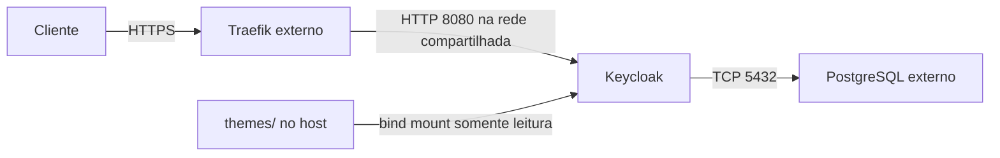

# Keycloak com Traefik e PostgreSQL externo

Implantação do Keycloak `26.8.0` para autenticação e gerenciamento de identidades com Docker Compose, PostgreSQL externo e HTTPS terminado em um Traefik externo. O projeto inclui apenas o serviço `keycloak`; banco, proxy, DNS e certificados exigem configuração separada.

## Sumário

- [Estrutura e funcionamento](#estrutura-e-funcionamento)
- [Pré-requisitos](#pré-requisitos)
- [Instalação](#instalação)
- [Variáveis](#variáveis)
- [Tema de login](#tema-de-login)
- [Operação e atualização](#operação-e-atualização)
- [Persistência, backup e restauração](#persistência-backup-e-restauração)
- [Solução de problemas](#solução-de-problemas)
- [Referências oficiais](#referências-oficiais)
- [Configurações a conferir](#configurações-a-conferir)

## Estrutura e funcionamento

| Arquivo ou diretório | Responsabilidade |
| --- | --- |
| `docker-compose.yml` | Serviço Keycloak, conexão ao banco externo, rede, labels do Traefik e healthcheck. |
| `env.example` | Modelo para criar o arquivo local `.env`. |
| `.env` | Configurações e credenciais locais; ignorado pelo Git. |
| `.gitignore` | Regras para excluir arquivos locais do versionamento. |
| `themes/` | Origem do bind mount em `/opt/keycloak/themes`, somente para leitura. A pasta está ignorada pelo Git. |
| `themes/unex/login/theme.properties` | Herança, CSS, idiomas e propriedades do tema de login `unex`. |
| `themes/unex/login/resources/` | CSS em `css/unex.css` e imagens em `img/logo.svg` e `img/login-background.jpg`. |
| `themes/unex/login/messages/` | Mensagens em `messages_pt.properties` e `messages_pt_BR.properties`. |



O Traefik usa a regra `Host` definida por `KEYCLOAK_DOMAIN` e encaminha as requisições do entrypoint `websecure` para a porta interna `8080`. O Keycloak configura `KC_HOSTNAME` como `https://` seguido desse domínio e aceita cabeçalhos `X-Forwarded-*` por meio de `KC_PROXY_HEADERS=xforwarded`. A comunicação HTTP entre proxy e Keycloak ocorre na rede compartilhada.

O serviço não publica portas no host. Health e métricas estão configurados como habilitados; o healthcheck consulta `/health/ready` na porta interna `9000`. Não há configuração de coleta de métricas nem roteamento dessa porta pelo Traefik neste projeto.

O container se chama `keycloak` e executa `start`, com reinício `unless-stopped`, limite de memória de `2g` e opção de segurança `no-new-privileges:true`. O nível de log é `info`, com saída JSON no console; o driver Docker `json-file` mantém até três arquivos de `10m`.

## Pré-requisitos

- Docker Engine e plugin Docker Compose (`docker compose`).
- PostgreSQL compatível com a versão do Keycloak e acessível pelo container na porta `5432`, com banco, usuário e permissões para gerenciar o esquema previamente preparados. A versão do PostgreSQL externo não é definida pelo repositório.
- Traefik com provider Docker, entrypoint `websecure` e resolver de certificados `cloudflare`, configurado com as credenciais necessárias no próprio proxy.
- Rede Docker externa compartilhada entre Traefik e Keycloak.
- Domínio com DNS apontando para o proxy e acesso HTTPS ao Traefik.
- Permissão para executar os comandos Docker. O comando de verificação HTTPS também requer `curl` no host.

O Compose fixa `KC_PROXY_TRUSTED_ADDRESSES` em `172.19.0.0/16`. Verifique se o IP do Traefik na rede compartilhada pertence a essa faixa. Se a infraestrutura usar outra faixa, ajuste essa configuração antes de iniciar; o nome da rede não garante compatibilidade.

## Instalação

Execute todos os comandos desta seção na raiz do repositório. Os nomes `proxy`, `auth.seudominio.com`, `postgres.interno` e `10.0.0.20` são os exemplos de `env.example`; substitua-os pelos valores da sua infraestrutura.

1. Prepare o arquivo local sem sobrescrever um `.env` existente:

   ```bash
   if [ ! -f .env ]; then
       cp env.example .env
   fi
   chmod 600 .env
   ```

   O resultado esperado é um `.env` acessível apenas ao proprietário. Edite-o com domínio, rede, hostname e IP do banco e senhas próprias. Não use as senhas de exemplo. Os parâmetros com padrão podem ser mantidos se corresponderem ao banco e ao usuário preparados.

2. Confira a rede externa, substituindo `proxy` pelo valor de `TRAEFIK_NET`:

   ```bash
   docker network inspect proxy
   ```

   Confira a configuração IPAM e a conexão do Traefik. Se a rede não existir, crie-a conforme o planejamento da infraestrutura e conecte o proxy antes de continuar.

3. Prepare o diretório montado para os temas:

   ```bash
   mkdir -p themes
   ```

   Se for usar `unex`, disponibilize os arquivos descritos na seção [Tema de login](#tema-de-login) antes de iniciar. Eles existem neste ambiente local, mas não são fornecidos por um clone do repositório porque `themes/` está ignorado pelo Git. Verifique o arquivo principal:

   ```bash
   test -r themes/unex/login/theme.properties
   ```

   Esse teste deve encerrar com código zero quando o arquivo está legível; ele não valida a renderização do tema. Sem o tema personalizado, a pasta pode permanecer vazia para uso dos temas nativos do Keycloak.

4. Valide a configuração sem imprimir as credenciais:

   ```bash
   docker compose config --quiet
   ```

   A validação deve encerrar com código zero e sem erros. Variáveis obrigatórias ausentes ou vazias impedem a execução. Esse comando verifica a configuração do Compose; não testa a existência da rede, a conexão com o banco nem os certificados.

5. Baixe a imagem e inicie o serviço:

   ```bash
   docker compose pull keycloak
   docker compose up -d keycloak
   ```

   O resultado esperado é a imagem disponível e o container iniciado em segundo plano. Em uma instalação existente, `up -d` pode recriar o container e interromper temporariamente o acesso.

6. Verifique o funcionamento:

   ```bash
   docker compose ps
   docker compose logs --tail=100 keycloak
   docker inspect --format '{{.State.Health.Status}}' keycloak
   curl --fail --head https://auth.seudominio.com/admin/
   ```

   `ps` deve mostrar o serviço em execução, e `inspect` deve retornar `healthy` após a inicialização. Nos logs, confira se houve falha de inicialização ou de conexão ao banco. O healthcheck tem intervalo de 30 segundos, timeout de 5 segundos, cinco tentativas e período inicial de 60 segundos. A marcação `unhealthy`, sozinha, não reinicia o container pela política `unless-stopped`.

   Substitua o domínio no `curl`. Uma resposta HTTP `2xx` ou `3xx`, com certificado válido, é esperada; erros HTTP a partir de `400` fazem esse comando falhar. Esse teste verifica o acesso HTTPS ao caminho administrativo, mas não confirma o login nem a renderização do tema.

7. Acesse `https://auth.seudominio.com/admin/` com seu domínio e as credenciais de bootstrap da instalação nova. Confirme o login no navegador e configure o realm e seus clients conforme a aplicação; não há importação automática de realms neste Compose.

## Variáveis

O Docker Compose lê `.env` na raiz para interpolar `${...}`. As variáveis da tabela são entradas do Compose, que as converte em configurações `KC_*`, labels e opções de rede. Valores exportados no shell têm precedência sobre o arquivo; confira-os se o resultado divergir do esperado.

Os padrões abaixo vêm das expressões do Compose e se aplicam a valores omitidos ou vazios nas variáveis opcionais. Os valores presentes em `env.example` são exemplos.

| Variável | Obrigatória | Padrão no Compose | Finalidade |
| --- | --- | --- | --- |
| `TRAEFIK_NET` | Sim | Sem padrão | Rede Docker externa compartilhada com o proxy. |
| `KEYCLOAK_DOMAIN` | Sim | Sem padrão | Domínio sem protocolo; compõe o hostname HTTPS e a regra de roteamento. |
| `KEYCLOAK_DB_HOST` | Sim | Sem padrão | Host do banco, associado ao IP por `extra_hosts`. |
| `KEYCLOAK_DB_IP` | Sim | Sem padrão | IP do PostgreSQL usado nessa associação. |
| `KEYCLOAK_DB_NAME` | Não | `keycloak` | Banco previamente criado. |
| `KEYCLOAK_DB_USER` | Não | `keycloak` | Usuário do PostgreSQL. |
| `KEYCLOAK_DB_PASSWORD` | Sim | Sem padrão | Senha do usuário do banco. |
| `KEYCLOAK_ADMIN_USER` | Não | `admin` | Administrador de bootstrap. |
| `KEYCLOAK_ADMIN_PASSWORD` | Sim | Sem padrão | Senha do administrador de bootstrap. |

A porta do banco `5432`, o entrypoint `websecure`, o resolver `cloudflare` e a faixa confiável do proxy estão fixos no Compose. Não há variáveis para alterá-los.

As credenciais de bootstrap criam um administrador temporário no primeiro início, quando o realm `master` ainda não existe. Depois de criar e testar um administrador permanente, remova a conta temporária pelo console. Alterar `.env` não redefine a senha de uma conta existente. Veja o [guia oficial de bootstrap e recuperação](https://www.keycloak.org/server/bootstrap-admin-recovery).

Proteja o arquivo e evite compartilhar a saída de `docker compose config` sem `--quiet`, pois ela pode conter senhas. O `.env` segue a sintaxe do Compose; confira as regras de aspas e interpolação antes de usar valores com caracteres especiais. Não carregue esse arquivo com `source` para executar os exemplos.

## Tema de login

O tema local `themes/unex/login` herda `keycloak.v2`, importa `common/keycloak` e usa `resources/css/unex.css`, imagens e mensagens em português. O arquivo `theme.properties` declara os idiomas `en` e `pt-BR` e define `darkMode=false`. A personalização local usa CSS e mensagens, sem templates FTL próprios.

Depois de disponibilizar os arquivos e iniciar o serviço:

1. No console administrativo, selecione o realm da aplicação.
2. Acesse **Realm Settings → Themes**, selecione `unex` em **Login theme** e salve.
3. Para oferecer seleção de idioma, habilite a internacionalização do realm e inclua os idiomas desejados nas configurações de localização.
4. Abra o login pela aplicação ou pelo Account Console, por exemplo `https://auth.seudominio.com/realms/meu-realm/account/`, substituindo domínio e `meu-realm`.

O resultado esperado é a página de login personalizada; a montagem não seleciona o tema automaticamente. Alterações podem exigir reinicialização e atualização do cache do navegador. O Compose não desabilita o cache de temas. Consulte o [guia oficial de temas](https://www.keycloak.org/ui-customization/themes).

## Operação e atualização

Na raiz do repositório:

```bash
# Acompanhar logs; Ctrl+C encerra apenas o acompanhamento
docker compose logs -f --tail=100 keycloak

# Reiniciar o processo; interrompe temporariamente o acesso
docker compose restart keycloak

# Aplicar mudanças no .env ou no Compose
docker compose up -d keycloak

# Parar e remover o container; interrompe o acesso
docker compose down
```

`restart` deve encerrar e iniciar novamente o processo; não aplica mudanças nas variáveis. Use `up -d` para recriar o serviço quando a configuração mudar e repita as verificações da instalação. `down` deve remover o container deste projeto; não remove o banco externo, os arquivos em `themes/` nem a rede externa compartilhada.

Para atualizar:

1. Faça backup do banco, dos temas e da configuração e confirme que consegue restaurá-los.
2. Revise o [guia oficial de atualização](https://www.keycloak.org/docs/latest/upgrading/index.html) e teste a versão de destino em ambiente separado.
3. Altere a tag da imagem no Compose.
4. Na raiz do repositório, execute:

   ```bash
   docker compose config --quiet
   docker compose pull keycloak
   docker compose up -d keycloak
   ```

5. Confira healthcheck, logs, acesso HTTPS e login, incluindo o tema personalizado.

A recriação interrompe temporariamente o serviço. Migrações de banco podem impedir o retorno direto a uma versão anterior; a recuperação pode exigir restaurar o backup anterior e a configuração compatível.

## Persistência, backup e restauração

Realms, usuários e configurações persistem no PostgreSQL externo. Não há volume de banco gerenciado pelo Compose. Inclua no backup o banco, os temas locais e a configuração de implantação, mantendo credenciais em local protegido.

Use o procedimento de backup do administrador do PostgreSQL, registrando as versões do banco e do Keycloak e os requisitos para recuperar usuários e permissões. Ferramentas como [pg_dump](https://www.postgresql.org/docs/current/app-pgdump.html) e [pg_restore](https://www.postgresql.org/docs/current/app-pgrestore.html) devem ser executadas em um ambiente com acesso ao banco e versões compatíveis; este repositório não fornece clientes PostgreSQL nem scripts de backup.

Para restaurar:

1. Teste o procedimento em ambiente separado antes de aplicá-lo à instalação em uso.
2. Interrompa as instâncias do Keycloak que usam o banco de destino. Neste projeto, execute `docker compose stop keycloak` na raiz; o serviço ficará indisponível.
3. Restaure o banco e as permissões conforme o procedimento do PostgreSQL. Substituir o banco de destino pode apagar os dados posteriores ao backup.
4. Reponha os temas, `.env` e a versão compatível da imagem; confira a rede e o proxy.
5. Execute `docker compose up -d keycloak` na raiz e valide healthcheck, login, realms e clients.

O resultado esperado é uma instalação funcional com os dados do ponto restaurado. Frequência, retenção e armazenamento dos backups precisam ser definidos pela operação.

## Solução de problemas

| Sintoma | Verificação |
| --- | --- |
| Variável obrigatória ausente | Confira `.env` na raiz e execute `docker compose config --quiet`. Inclua `KEYCLOAK_DB_IP`. |
| Rede externa não encontrada | Confira `TRAEFIK_NET`, a existência da rede e a conexão do proxy. |
| Falha de conexão ao banco | Confira IP, host, porta `5432`, regras de rede, credenciais e banco. `extra_hosts` fixa a resolução do host para o IP informado. |
| Erro de certificado ou HTTPS | Confira DNS, entrypoint `websecure`, resolver `cloudflare` e logs do Traefik externo. |
| Resposta 502 | Confira estado do Keycloak, rede compartilhada e encaminhamento à porta `8080`. |
| URLs ou cabeçalhos de proxy incorretos | Confira domínio e IP do Traefik dentro da faixa confiável `172.19.0.0/16`. |
| Container `unhealthy` | Examine os logs de inicialização e a conexão ao banco; o healthcheck usa a porta `9000`. |
| Tema ausente | Confira arquivos, permissões, montagem e seleção no realm. A pasta está ignorada pelo Git. |
| Senha do administrador não muda | As variáveis configuram o bootstrap; altere a conta existente pelo Keycloak. |

## Referências oficiais

- [Keycloak em containers](https://www.keycloak.org/server/containers): execução da imagem e opções de inicialização.
- [Keycloak com proxy reverso](https://www.keycloak.org/server/reverseproxy): portas, cabeçalhos e integração com o proxy.
- [Banco de dados do Keycloak](https://www.keycloak.org/server/db): configuração e compatibilidade de bancos.
- [Docker Compose: variáveis de ambiente](https://docs.docker.com/compose/how-tos/environment-variables/envvars/): carregamento do ambiente.
- [Docker Compose: validação da configuração](https://docs.docker.com/reference/cli/docker/compose/config/): uso de `config` e `--quiet`.
- [Traefik: roteamento com Docker](https://doc.traefik.io/traefik/reference/routing-configuration/other-providers/docker/): labels, serviços e rede.

As referências acompanham a documentação publicada pelos projetos. Para uma atualização, confira as orientações aplicáveis à versão de destino; a versão usada nesta configuração continua sendo a tag definida no Compose.

## Configurações a conferir

| Ponto | Situação no repositório e ação necessária |
| --- | --- |
| Endereços confiáveis do proxy | Faixa fixa `172.19.0.0/16`; confira sua correspondência com a rede real. Ela abrange todos os endereços da faixa, não apenas o Traefik. |
| Temas em novas instalações | `themes/` está ignorado e não há arquivos desse diretório rastreados pelo Git. Providencie a distribuição e o backup do tema `unex` se ele for necessário. |
| PostgreSQL e Traefik | Não são criados pelo Compose. Confirme banco, permissões, rede, DNS, entrypoint e resolver `cloudflare` na infraestrutura externa. |
| Recuperação | Não há automação de backup e restauração; estabeleça e teste o procedimento externo. |

Esses pontos exigem conferência no ambiente de implantação. A documentação descreve a configuração presente; a validação local do Compose não comprova o funcionamento dos serviços externos.
